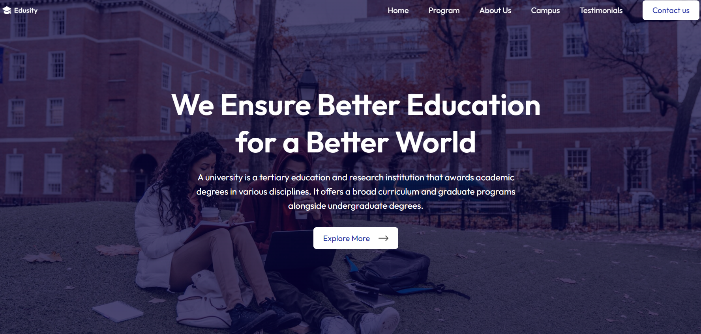

 ##🎓 Edusity - Online Education Platform (Frontend Only)

Edusity is a modern and responsive **React.js + CSS** frontend website for an online education platform.  
Users can explore courses, colleges, and student reviews.  

---

## 🚀 Features
- Responsive design for mobile, tablet, and desktop
- Navigation bar with multiple pages
- Hero section with call-to-action
- Courses, About, and Contact sections
- Footer with quick links

---

## 🛠️ Tech Stack
- React.js
- CSS
- React Router DOM
- Vite / Create React App

 
